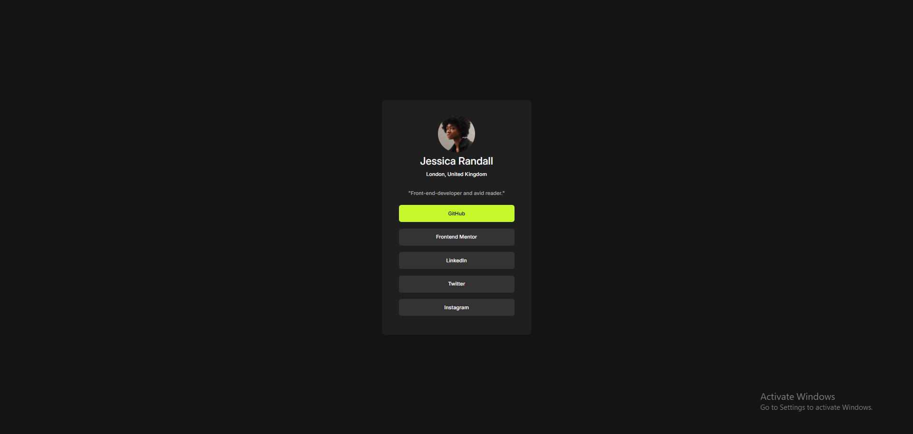

# Frontend Mentor - Social links profile solution

This is a solution to the [Social links profile challenge on Frontend Mentor](https://www.frontendmentor.io/challenges/social-links-profile-UG32l9m6dQ). Frontend Mentor challenges help you improve your coding skills by building realistic projects. 

## Table of contents

- [Overview](#overview)
  - [The challenge](#the-challenge)
  - [Screenshot](#screenshot)
  - [Links](#links)
- [My process](#my-process)
  - [Built with](#built-with)
  - [What I learned](#what-i-learned)
  - [Continued development](#continued-development)
  - [Useful resources](#useful-resources)
- [Author](#author)
- [Acknowledgments](#acknowledgments)

**Note: Delete this note and update the table of contents based on what sections you keep.**

## Overview

Social links profile

### The challenge

Users should be able to:

- See hover and focus states for all interactive elements on the page

### Screenshot



### Links

- Solution URL: [Add solution URL here](https://your-solution-url.com)
- Live Site URL: [Add live site URL here](https://your-live-site-url.com)

## My process

### Built with

- Semantic HTML5 markup
- CSS custom properties
- Flexbox
- Mobile-first workflow

### What I learned

- Breakpoint for mobile view

```css
@media screen and (max-width:380px){
    .card-container{
        height: 500px;
        width: 300px;
        padding: 8px;
    }
    .img-avatar{
        height: 20%;
    }
    .card-container img{
        width: 25%;
    }
    .card-container h2{
        font-size: 15px;
    }
    .card-container .state{
        font-size: 10px;
    }
    .card-container .text{
        font-size: 10px;
    }
    .link-flex-container .link-github{
        height: 40px;
        margin-top: 19px;
        font-size: 10px;
    }
    .link-flex-container .link-frontend{
        height: 40px;
        margin-top: 12px;
        font-size: 10px;
    }
    .link-flex-container .link-linkedin{
        height: 40px;
        margin-top: 12px;
        font-size: 10px;
    }
    .link-flex-container .link-twitter{
        height: 40px;
        margin-top: 12px;
        font-size: 10px;
    }
    .link-flex-container .link-instagram{
        height: 40px;
        margin-top: 12px;
        font-size: 10px;
    }
      
}
```

### Continued development

- In future projects will focus on using css frameworks.

### Useful resources

- [CSS Tricks](https://css-tricks.com/centering-css-complete-guide/) - This helped me for Centering in CSS. I really liked this pattern and will use it going forward.
- [MDN Web Docs](https://developer.mozilla.org/en-US/docs/Glossary/Flexbox) - This is an amazing free resource which helped me finally understand Flexbox. I'd recommend it to anyone still learning this concept.

## Author

- GitHub - [@Jayajo5](https://github.com/Jayajo5)
- Frontend Mentor - [@Jayajo5](https://www.frontendmentor.io/profile/Jayajo5)

## Acknowledgments

A big thanks to the Frontend Mentor community for feedback and inspiration! 🚀
